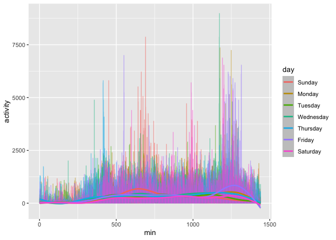

Homework 3
================
Vera Xu

This is my solution to HW3.

``` r
library(tidyverse)
library(p8105.datasets)
```

### Problem 1 demonstrated by Jeff in class

``` r
data("instacart")
```

This dataset contains 1384617 rows and … columns.

Observations are the level of items in orders by user. There are user /
order variables – user ID, order ID, order day, and order hour. There
are also item variables – name, aisle, department, and some numeric
codes.

How many aisles, and which are most items from?

``` r
instacart %>% 
    count(aisle) %>% 
    arrange(desc(n))
```

    ## # A tibble: 134 x 2
    ##    aisle                              n
    ##    <chr>                          <int>
    ##  1 fresh vegetables              150609
    ##  2 fresh fruits                  150473
    ##  3 packaged vegetables fruits     78493
    ##  4 yogurt                         55240
    ##  5 packaged cheese                41699
    ##  6 water seltzer sparkling water  36617
    ##  7 milk                           32644
    ##  8 chips pretzels                 31269
    ##  9 soy lactosefree                26240
    ## 10 bread                          23635
    ## # … with 124 more rows

Let’s make a plot

``` r
instacart %>% 
    count(aisle) %>% 
    filter(n > 10000) %>% 
    mutate(
        aisle = factor(aisle),
        aisle = fct_reorder(aisle, n)
    ) %>% 
    ggplot(aes(x = aisle, y = n)) + 
    geom_point() + 
    theme(axis.text.x = element_text(angle = 90, vjust = 0.5, hjust = 1))
```

<!-- -->

Let’s make a table\!\!

``` r
instacart %>% 
    filter(aisle %in% c("baking ingredients", "dog food care", "packaged vegetables fruits")) %>% 
    group_by(aisle) %>% 
    count(product_name) %>% 
    mutate(rank = min_rank(desc(n))) %>% 
    filter(rank < 4) %>% 
    arrange(aisle, rank) %>% 
    knitr::kable()
```

| aisle                      | product\_name                                 |    n | rank |
| :------------------------- | :-------------------------------------------- | ---: | ---: |
| baking ingredients         | Light Brown Sugar                             |  499 |    1 |
| baking ingredients         | Pure Baking Soda                              |  387 |    2 |
| baking ingredients         | Cane Sugar                                    |  336 |    3 |
| dog food care              | Snack Sticks Chicken & Rice Recipe Dog Treats |   30 |    1 |
| dog food care              | Organix Chicken & Brown Rice Recipe           |   28 |    2 |
| dog food care              | Small Dog Biscuits                            |   26 |    3 |
| packaged vegetables fruits | Organic Baby Spinach                          | 9784 |    1 |
| packaged vegetables fruits | Organic Raspberries                           | 5546 |    2 |
| packaged vegetables fruits | Organic Blueberries                           | 4966 |    3 |

Apples vs ice cream..

``` r
instacart %>% 
    filter(product_name %in% c("Pink Lady Apples", "Coffee Ice Cream")) %>% 
    group_by(product_name, order_dow) %>% 
    summarize(mean_hour = mean(order_hour_of_day)) %>% 
    pivot_wider(
        names_from = order_dow,
        values_from = mean_hour
    )
```

    ## # A tibble: 2 x 8
    ## # Groups:   product_name [2]
    ##   product_name       `0`   `1`   `2`   `3`   `4`   `5`   `6`
    ##   <chr>            <dbl> <dbl> <dbl> <dbl> <dbl> <dbl> <dbl>
    ## 1 Coffee Ice Cream  13.8  14.3  15.4  15.3  15.2  12.3  13.8
    ## 2 Pink Lady Apples  13.4  11.4  11.7  14.2  11.6  12.8  11.9

### Question 2

#### Load and tidy the data

``` r
p2_df = 
  read_csv("./data/accel_data.csv") %>%
  janitor::clean_names() %>%
  pivot_longer(
   activity_1:activity_1440,
   names_prefix = "activity_",
   names_to = "min",
   values_to = "activity"
   ) %>%
   mutate(
    weekday = ifelse(day %in% c("Saturday", "Sunday"), FALSE, TRUE),
    min = as.numeric(min),
    day = factor(day, 
                 levels=c("Sunday","Monday","Tuesday","Wednesday","Thursday","Friday","Saturday")
                 ) 
    )%>%
  arrange(day) %>%
  select(-day_id)
```

  - The resulting dataset contains 5 columns and 50400 rows.
  - Variables are: week, day of the week, weekday (True or False),
    minute of the day and activity.

#### Total activity of each day

Total activity of each day is computed using the following code chunk:

``` r
p2_df %>%
  group_by(week, day) %>% 
  summarize(total_activity = sum(activity))%>%
  mutate(total_activity = round(total_activity, 0))%>%
  pivot_wider (
    names_from = day,
    values_from = total_activity
  )
```

    ## # A tibble: 5 x 8
    ## # Groups:   week [5]
    ##    week Sunday Monday Tuesday Wednesday Thursday Friday Saturday
    ##   <dbl>  <dbl>  <dbl>   <dbl>     <dbl>    <dbl>  <dbl>    <dbl>
    ## 1     1 631105  78828  307094    340115   355924 480543   376254
    ## 2     2 422018 295431  423245    440962   474048 568839   607175
    ## 3     3 467052 685910  381507    468869   371230 467420   382928
    ## 4     4 260617 409450  319568    434460   340291 154049     1440
    ## 5     5 138421 389080  367824    445366   549658 620860     1440

  - It seems that this person tend to have a stable level of activity
    over the weekdays, with extremely low activity levels on the
    Saturday of week 4 and 5.
  - It also seems like this person is more active on week 2 Friday, Week
    3 Monday and Week 5 Thursday and Friday.

#### Activity level plot by day

``` r
p2_df %>%
  ggplot(aes(x = min, y = activity)) + 
  geom_line(aes(colour = day), alpha = 0.5)+
  geom_smooth(aes(colour = day), alpha = 0.5)
```

<!-- -->

  - It looks like this person is active during daytime and not active
    after midnight.
  - There are several peaks of activity during weekdays in the mornings
    and evenings.
  - This person is more active during weekdays, in general.

### Question 3

#### Load and tidy the data

``` r
p3_df =
  ny_noaa %>%
  separate(date, c("year", "month", "day"), sep = "-") %>%
  mutate(
    year = as.numeric(year),
    month = as.numeric(month),
    day = as.numeric(day),
    prcp = as.numeric(prcp)*0.1,
    tmax = as.numeric(tmax)*0.1,
    tmin = as.numeric(tmin)*0.1)
```

  - The tidied dataset contains 9 columns and 2595176 rows.
  - Variables are: weather station ID, year, month, day, precipitation
    (in mm), snowfall (in mm), snow depth (in mm), maximum temperature
    (in degree C), minimum temperature (in degree C).
  - There are a lot of missing values in this data set:
      - The precipitation variable has 145838 missing values
      - The snowfall has 381221 missing values
      - The snow depth variable has 591786 missing values
      - The minimum temperature has 1134420 missing values
      - The maximum temperature has 1134358 missing values

#### Answer to the questions

  - For snowfall, most commonly observed values is 0, there are 2008508
    rows with a 0 snowfall record.

  - Plot showing the average max temperature in January and in July in
    each station across years:

<!-- end list -->

``` r
p3_df %>%
  filter(month == 1 | month == 7) %>%
  group_by(id, year, month) %>%
  mutate(
    avg_tmax = mean(tmax, na.rm = TRUE),
    month = month.name[month]) %>%
  ggplot(aes(x = year, y = avg_tmax, color = month)) + 
  geom_point(size = 0.1)+
  geom_smooth(alpha = 0.5, se = FALSE)+
  facet_grid(~month)+
  theme(legend.position="none")+
  scale_color_manual(values=c("blue", "orange"))
```

<!-- -->

Observable and interpretable structure: It is warmer in July overall.
The average maximum temperature among different stations has a smaller
fluctuation range among July over the years, as compared to January. It
seems that there is not apparent global warming trend from this plot.
There seem to be extremely cold winters around 1993\~1994 and around
2002-2004.

  - Make a two-panel plot that consist of
      - maximum temperature vs minimum temperature for the full dataset
      - distribution of snowfall values (between 0 and 100) over the
        years

<!-- end list -->

``` r
library("patchwork")

p3_3_a <- 
  p3_df %>% 
  ggplot(aes(x = tmin, y = tmax)) + 
  geom_hex()

p3_3_b <- 
p3_df %>% 
  filter(snow < 100 & snow > 0) %>%
  mutate(year = factor(year)) %>%
  ggplot(aes(x = year, y = snow)) + 
  geom_violin(aes(fill = year), alpha = 0.3, draw_quantiles = c(0.25, 0.5, 0.75))+
  theme(axis.text.x = element_text(angle = 90),
        legend.position="none")

p3_3_a/p3_3_b
```

<!-- -->
